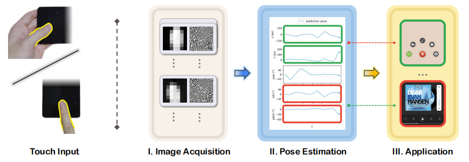
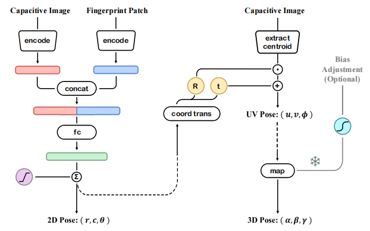
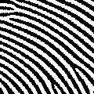
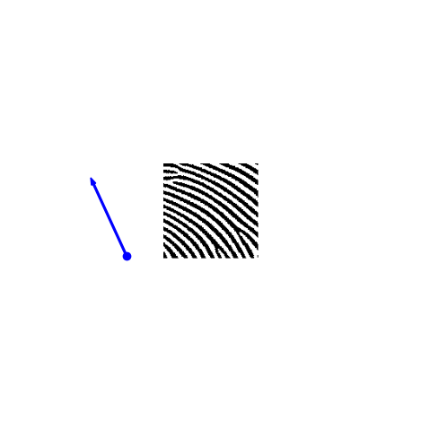
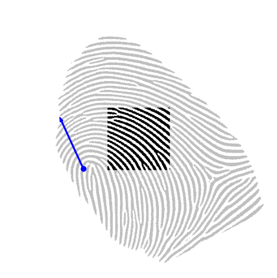

<!--
 * @Description:
 * @Author: Xiongjun Guan
 * @Date: 2025-04-27
 * @version: 0.0.1
-->

# DualFingerPose

<h5 align="left"> If our project helps you, please give us a star ⭐ on GitHub to support us. 🙏🙏 </h2>

<br>


### :speech_balloon: This repo is the official implementation of:

- **_Under Review_**: [BiFingerPose: Bimodal Finger Pose Estimation for Touch Devices]()

[Xiongjun Guan](https://xiongjunguan.github.io/), Zhiyu Pan, Jianjiang Feng, Jie Zhou

---

## :art: Introduction

We propose a **Bi**modal based **Finger** **Pose** estimation algorithm, termed **BiFingerPose**, which achieves precise and stable predictions for all degrees of freedom in 2D/3D pose parameters.
Concretely, we first designed a convolutional neural network to predict the 2D finger pose, and subsequently mapped it to the 3D pose using our proposed pose transformation function.

:point_up: The overview of this work is shown as follows.

<p align="center">
     <br />
</p>

- `Touch input`: Users change their finger pose in any comfortable way to perform interactive operations on touch devices.
- `I. Image Acquisition`: Touch devices with under-screen fingerprint sensors simultaneously capture capacitive images and fingerprint patches.
- `II. Pose Estimation`: Our BiFingerPose ultilizes capacitive image and fingerprint patch to provide robust, precise and comprehensive finger pose estimation.
- `III. Application`: The pose information is used for various applications, which exhibits great compatibility and complementarity with common actions and can be integrated to further enhance interactive applications.

<br>

:point_up: The flowchart of `BiFingerPose` is shown as follows.

<p align="center">
     <br />
</p>

The `2D finger pose` is initially estimated by the network on the left, then transformed to `UV pose` via the upper right conversion functions, and finally mapped to `3D pose` with the assistance of adjusted freezing parameters. Optionally, users can further enhance the mapping accuracy through a few corrections.

<br>

## :wrench: Requirements

```text
matplotlib==3.8.2
numpy==2.2.5
opencv_contrib_python==4.10.0.84
opencv_python==4.8.1.78
PyYAML==6.0.1
PyYAML==6.0.2
scipy==1.15.2
torch==2.1.2
torchvision==0.16.2
tqdm==4.66.1
```

<br>

## :train: Train

### :pushpin: Image to 2D pose

If you want to train our network, please first construct the training set and overview file.

```
train_info / valid_info :
{
    "fp_bimg_lst": [...] # list of img path
    "seg_lst": [...] # list of mask path, no need to set in this work
    "pose_lst" [...] # list of pose ground truth path

}
```

Next, you need to adjust the file path, network structure, and training parameters according to your needs:

```
./configs/config_DualFingerPose.yaml
./args.py
```

Finally, set the corresponding configuration path in the training file to train our network !

```shell
python train.py
```

### :pushpin: 2D Pose to UV pose

This is a parameter free spatial transformation that is directly integrated into our inference code.

### :pushpin: UV pose to 3D pose

If you want to fit this function, please first construct the training set as:

```
center_pose_dict :
{
    "r_arr": [...] # list of row position
    "c_arr": [...] # list of yaw position
    "roll_arr" [...] # list of roll angle
    "pitch_arr" [...] # list of pitch angle

}
```

Then, you should run the code below to obtain the optimal mapping parameters that fit this set of data:

```shell
python map_uv_3d.py
```

<br>

## :rocket: Inference

The model weight can be download at this link.

You need to organize the file structure as follows:

```
|-ckpts                 # parameters downloaded from the link
|  |-DualFingerPose
|  |  |-best.pth
|  |  |-config.yaml
|  |  |-map_example.pkl

|-example               # images, maintain consistency in the ID of the same sample
|  |-cap/...            # capacitive images
|  |-patch/...          # fingerprint patches
|  |-fp/...             # plain fingerprints (optional, if you want to use it
                        # as background during visualization)
|  |-result/...         # estimation and visualization results

|-inference.py          # inference code
|-...                   # other codes
```

Set the corresponding `dir/path` and adjust the parameters of `argparse` to enjoy our DualFingerPose !

```shell
# If you only have capacitive images and fingerprint patches from touch devices:
python inference.py -show_mode="patch"  # use fingerprint patch as background

# If you use plain fingerprint synthesis data and want a more intuitive observation:
python inference.py -show_mode="fp"  # use plain fingerprint (non collection area is set to gray) as background

```

<br>

## :moyai: Example

We have provided 10 examples in `./example` obtained from inference code. One of them is shown below.

:arrow_down_small: **input**
<table style="margin: auto;">
  <tr>
    <td align="center">
      
    </td>
    <td align="center">
      
    </td>
  </tr>
  <tr>
    <td align="center">capacitive image</td>
    <td align="center">fingerprint patch</td>
  </tr>
</table>
<br>

:arrow_down_small: **visualization**

<table style="margin: auto;">
  <tr>
    <td align="center">
      
    </td>
    <td align="center">
      
    </td>
  </tr>
  <tr>
    <td align="center">show_mode: patch</td>
    <td align="center">show_mode: fp</td>
  </tr>
</table>
<br>

:arrow_down_small: **estimated info**

```
# 2d pose (x, y, theta)
149.02591 312.88098 24.657104
# uv pose (u, v, phi)
376.9502657944249 248.93355886274276 -24.6571044921875
# 3d pose (roll, pitch, yaw)
45.8372842095897 -27.721439252022392 -24.6571044921875
```

<br>

## :bookmark_tabs: Citation

If you find this repository useful, please give us stars and use the following BibTeX entry for citation.

<br>

## :triangular_flag_on_post: License

This project is released under the MIT license. Please see the LICENSE file for more information.

<br>

---

## :mailbox: Contact Me

If you have any questions about the code, please contact Xiongjun
Guan gxj21@mails.tsinghua.edu.cn
